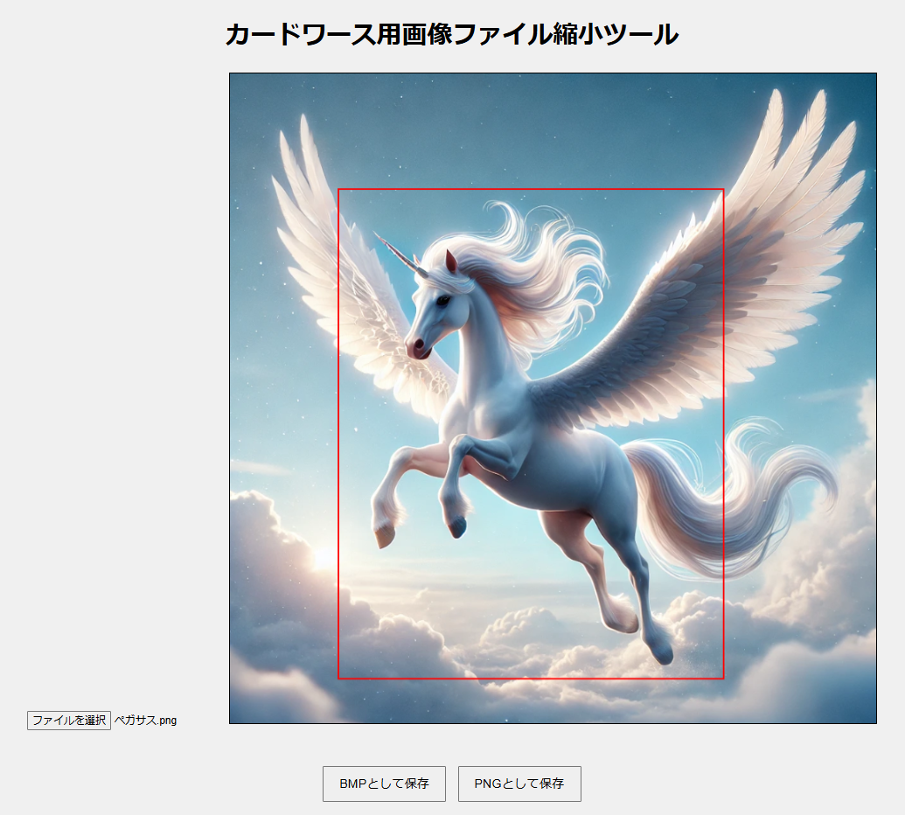

# カードワース用画像ファイル縮小ツール

このツールは、カードワース用の画像ファイルを74x94ピクセルのサイズにリサイズするための簡単なブラウザベースのアプリケーションです。

## 使用方法
1. ローカルの画像ファイルを「ファイル選択」ボタンから選択します。
2. ブラウザ上で表示された画像の上に赤い枠をドラッグして、リサイズしたい部分を選択します。
3. 「BMPとして保存」または「PNGとして保存」ボタンをクリックして、リサイズされた画像をダウンロードします。

## URL

https://kichouji.github.io/cw-image-resizer/

## ライセンス
このプロジェクトは [MIT License](./LICENSE) の下で公開されています。
