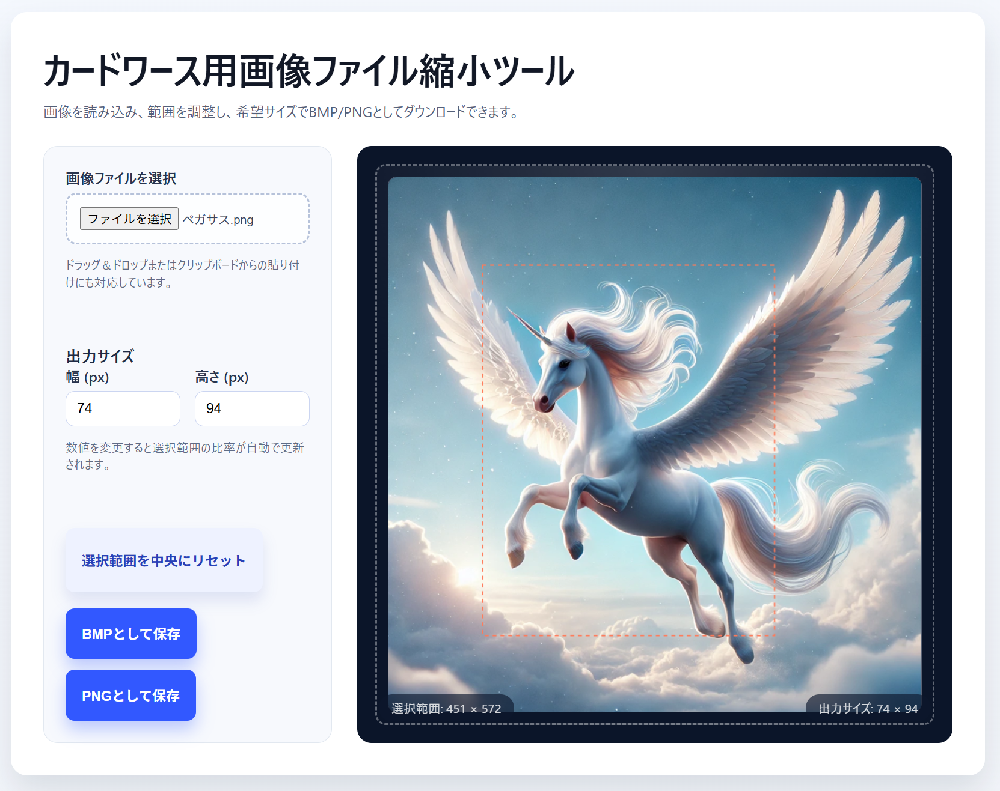

# カードワース用画像ツール

カードワースをはじめとするレトロゲーム向けの画像処理ができるブラウザベースのツール集です。

## URL

https://kichouji.github.io/cw-image-resizer/

## ツール一覧

### 画像リサイズツール（index.html）

画像を読み込み、任意の範囲を選択して指定サイズにリサイズ・ダウンロードします。

**使い方**
1. 画像ファイルを選択（ファイル選択・ドラッグ＆ドロップ・クリップボード貼り付け対応）
2. 赤枠をドラッグして切り出す範囲を選択
3. 出力サイズを指定（CardWirth 74×94・Elona 80×112のプリセットあり）
4. 「BMPとして保存」または「PNGとして保存」でダウンロード

### 背景透過ツール（bg-remover.html）

指定した色をしきい値ベースで透明化し、結果をリアルタイムで確認しながら保存します。

**使い方**
1. 画像ファイルを選択（ファイル選択・ドラッグ＆ドロップ・クリップボード貼り付け対応）
2. 元画像をクリックして基準色を指定（初期値：左上ピクセルの色）
3. しきい値スライダーで透過範囲を調整
4. プレビュー背景を切り替えて結果を確認（市松・黒・ピンク・緑・カスタム）
5. 保存形式（PNG / BMP）とモード（透過保持 / 背景色合成）を選択してダウンロード

## ライセンス

このプロジェクトは [MIT License](./LICENSE) の下で公開されています。
